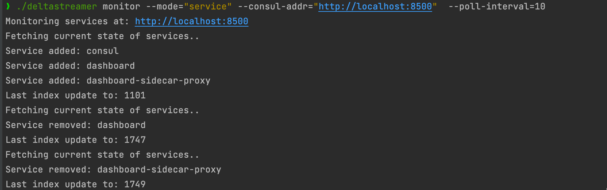
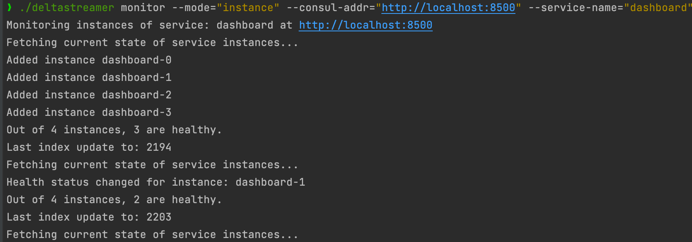

# DeltaStreamer

## Overview

DeltaStreamer is a tool designed to efficiently monitor and stream deltas (changes) in service states within Consul clusters. It focuses on delivering only the changes in service registration, deregistration, and health status, rather than the entire payload. This approach significantly reduces network traffic and processing overhead, making it ideal for large-scale deployments with frequent changes.

## Features

- **Efficient Change Detection**: Tracks and streams only the deltas in service states, including registrations, deregistrations, and health status updates.
- **Customizable Polling Intervals**: Offers configurable polling intervals to balance between real-time updates and system resource utilization.
- **Consul Blocking Queries**: Utilizes Consul's blocking query mechanism to efficiently detect changes in the service catalog.
- **Scalable Architecture**: Designed to efficiently handle large numbers of services and high rates of change.
- **Simple Integration**: Easy to integrate with existing Consul setups, requiring minimal configuration.
- **Configurable Start Index**: Allows operators to specify the starting index for monitoring, providing control over the initial state of watch.

## Getting Started

### Prerequisites

- Go version 1.15 or higher
- Access to a Consul cluster

### Installation

1. Clone the repository:
   ```shell
   git clone https://github.com/markcampv/deltastreamer.git

2. Navigate to the cloned directory:
   ```shell
   cd deltastreamer
   
3. Build the application:
   ```shell
   go build -o deltastreamer .
   
### Usage
To start monitoring your Consul services, use the following command. Adjust the command basd on whether you're monitoring service registrations,
or service instances

#### For Service Registrations

```shell
./deltastreamer monitor --consul-addr="http://localhost:8500" --poll-interval=10 --start-index=0
```
- **--consul-addr: Specifies the address of the Consul server.**
- **--poll-interval: --consul-addr: Specifies the address of the Consul server.**
- **--start-index: Sets the initial index from which to begin monitoring for changes.**
- **--mode: Specifies the monitoring mode. Use "service" for service registration/deregistration monitoring, and "instance" for monitoring specific service instances and their health.**
- **--service-name: Specifies the name of the service to monitor instances for. Required when --mode is set to "instance".**

### Example Output

When executing the 'deltastreamer' command, you'll observce output that varies depending on the monitoring mode.
Below are examples of what you might see for each mode:

#### Monitoring Service Registrations

When monitoring service registrations and deregistrations (`--mode="service"`), the output will detail the changes detected in the overall service catalog within your Consul cluster.



#### Monitoring Service Instances

In contrast, when monitoring specific service instances and their health status (`--mode="instance"`), the output focuses on the health changes, additions, or removals of instances for a particular service.



These screenshots provide a glimpse into the actionable insights `deltastreamer` can offer, aiding in the proactive management and troubleshooting of your services in Consul.

